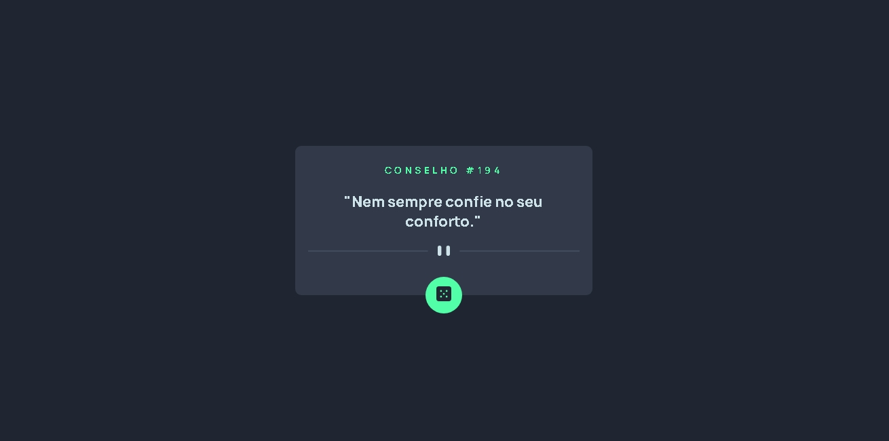

# Frontend Mentor - Advice generator app solution

This is a solution to the [Advice generator app challenge on Frontend Mentor](https://www.frontendmentor.io/challenges/advice-generator-app-QdUG-13db). Frontend Mentor challenges help you improve your coding skills by building realistic projects.

## Table of contents

- [Overview](#overview)
  - [The challenge](#the-challenge)
  - [Screenshot](#screenshot)
  - [Links](#links)
- [My process](#my-process)
  - [Built with](#built-with)
  - [What I learned](#what-i-learned)
  - [Continued development](#continued-development)
  - [Useful resources](#useful-resources)
- [Author](#author)
- [Acknowledgments](#acknowledgments)

**Note: Delete this note and update the table of contents based on what sections you keep.**

## Overview

### The challenge

Users should be able to:

- View the optimal layout for the app depending on their device's screen size
- See hover states for all interactive elements on the page
- Generate a new piece of advice by clicking the dice icon

### Screenshot



### Links

- Solution URL: [Código](https://github.com/WellissonLima/advice-generator-app-main)
- Live Site URL: [Projeto](https://wellissonlima.github.io/advice-generator-app-main/)

## My process

### Built with

- Semantic HTML5 markup
- CSS custom properties
- Flexbox
- CSS Grid

### What I learned

Na movimentação do de objetos por meio da propriedade fiz uso da propriedade transform pela primeira vez, ela é uma ótima ferramenta de posicionamento de objetos e pode atender nossas necessidades em diversas situações, outra coisa que me ajudou a concluir o desafio foi o uso de InnerText para visualizar e inserir textos por meio do JS.

```css
.card .dice {
  transform: translateY(50%)
}
```
```js
const proudOfThisFunc = () => {
  proudOfThisFunc.innerText = "string"
}
```

### Continued development

Consumir uma API foi uma experiência um pouco trabalhasa e desafiadora que teve um resultado incrível, pretendo continuar me aperfeiçoando e melhorando minhas habilidades para poder concluir projetos cada vez mais interessantes e dinâmicos.

### Useful resources

- [mdn web docs_](https://developer.mozilla.org/pt-BR/) - Esse site foi de grande ajuda para mim, com documentação a respeito do JS e de suas propriedades e funcionalidades, pude tirar dúvidas nesse desafio em relação especialmente ao innerText.
- [ChatGPT](https://chatgpt.com/) - Esse foi um recurso que me ajudou posibilitando acesso a informações e explicações a cerca dos conteúdos bem como me trazendo exemplosde ussos das propriedades que esta em dúvida.

## Author

- Portifólio - [Wellisson Lima](https://wellissonlima.github.io/portifolio-wl/)
- Frontend Mentor - [@WellissonLima](https://www.frontendmentor.io/profile/WellissonLima)
- GitHub - [@WellissonLima](https://github.com/WellissonLima)
